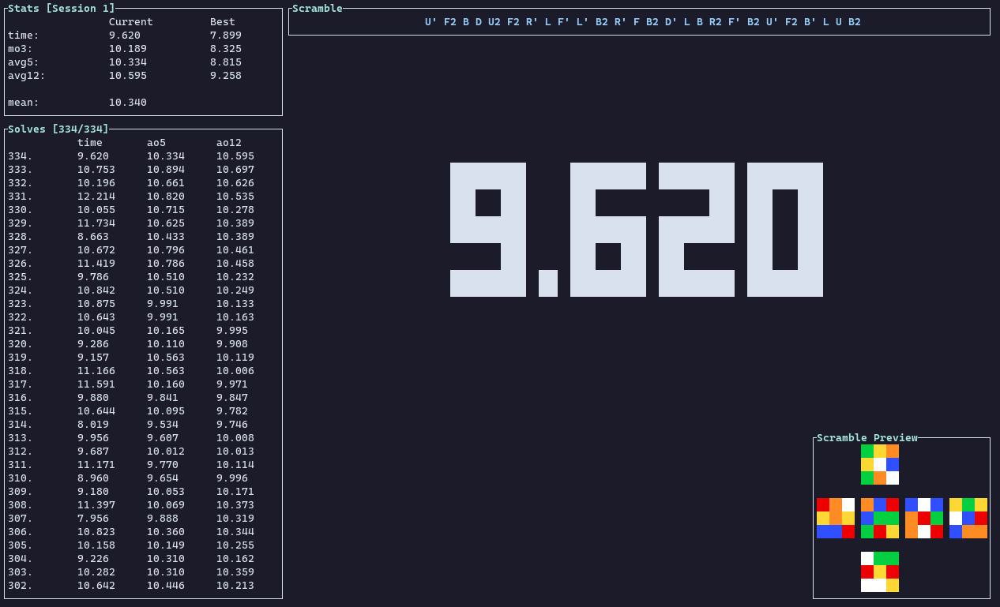

# tsctimer



## Installation

```
cargo install tsctimer --git https://github.com/sarowish/tsctimer
```

## Key Bindings

| Key Binding                | Action                                               |
| -------------------------- | ---------------------------------------------------- |
| `space (hold and release)` | start timer                                          |
| `space`                    | start inspection / stop timer                        |
| `esc`                      | abort timer / inspection                             |
| `k, up`                    | move one line upward                                 |
| `j, down`                  | move one line downward                               |
| `g`                        | jump to first line                                   |
| `G`                        | jump to last line                                    |
| `ctrl-d`                   | scroll solves list downwards half a page             |
| `ctrl-u`                   | scroll solves list upwards half a page               |
| `ctrl-f`                   | scroll solves list downwards one page                |
| `ctrl-b`                   | scroll solves list upwards one page                  |
| `ctrl-e`                   | scroll solves list downwards (without moving cursor) |
| `ctrl-y`                   | scroll solves list upwards (without moving cursor)   |
| `r`                        | rescramble                                           |
| `R`                        | display last scramble                                |
| `e`                        | enable/disable inspection                            |
| `E`                        | enable/disable inspection warning                    |
| `i`                        | toggle solve info window                             |
| `d`                        | delete selected solve                                |
| `c`                        | delete session                                       |
| `D`                        | mark selected solve as dnf                           |
| `p`                        | mark selected solve as +2                            |
| `s`                        | switch to next session                               |
| `S`                        | switch to previous session                           |
| `q`                        | quit application                                     |
